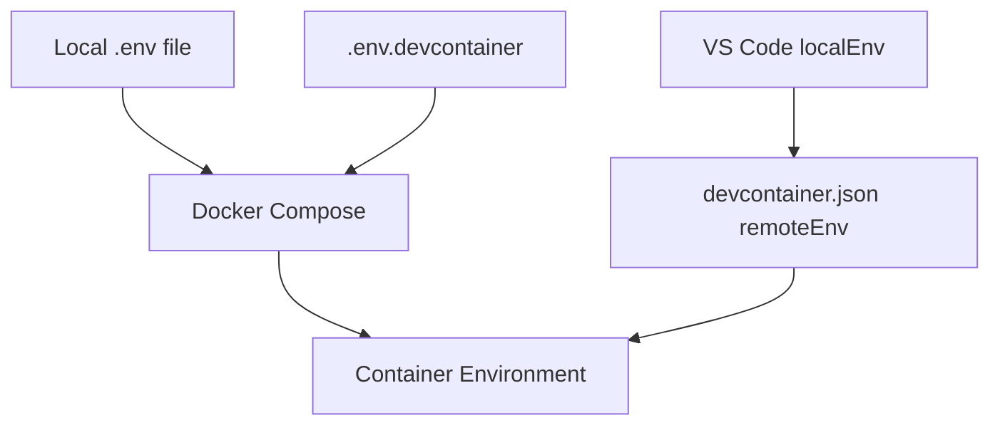

# DevContainer Environment Variables Test Plan

## Current Setup Analysis

1. **DevContainer Configuration**
- Uses `remoteEnv` in devcontainer.json with `${localEnv:VAR}` syntax
- Relies on Docker Compose file extending base compose
- Has two env file sources:
  ```yaml
  env_file:
    - ../.env
    - .env.devcontainer
  ```

2. **Variable Flow**


## Test Cases

1. **Environment Variable Source Testing**
```bash
# Test 1: Direct environment variables
export TEST_VAR=test_value
docker compose --env-file .env up

# Test 2: Multiple env files
cp .env .env.test
docker compose --env-file .env --env-file .env.test up

# Test 3: DevContainer specific
echo "TEST_VAR=override_value" > .devcontainer/.env.devcontainer
```

2. **Variable Interpolation Points**
```yaml
# Add test variables at different points
services:
  strapi:
    environment:
      TEST_BUILD_VAR: ${BUILD_VAR}
      TEST_RUNTIME_VAR: ${RUNTIME_VAR}
```

3. **VSCode Integration Tests**
- Test with/without `remoteEnv` in devcontainer.json
- Test direct vs ${localEnv:VAR} syntax
- Test variable persistence across container rebuilds

## Alternative Approaches to Test

1. **Environment File Location Test**
```yaml
include:
  - path: ../docker-compose.yml
    env_file: ../.env
```

2. **Variable Export Test**
```bash
#!/bin/bash
# test-env.sh
set -a
source .env
docker compose up
```

3. **Build Args Test**
```dockerfile
ARG BUILD_TIME_VAR
ENV RUNTIME_VAR=${BUILD_TIME_VAR}
```

## Debug Checkpoints

Add logging at critical points:
```yaml
services:
  strapi:
    command: |
      sh -c '
        echo "=== Build Variables ==="
        env | grep TEST_
        echo "=== Runtime Variables ==="
        env | grep DATABASE_
        sleep infinity
      '
```

## Expected Outcomes

1. Variables should be available:
- At container build time
- During container runtime
- In VSCode terminal
- In devcontainer terminal
- Across container restarts

2. Variable Precedence:
- .env.devcontainer should override .env
- remoteEnv should override env_file values
- Shell environment should override file-based env

## Next Steps

1. Implement each test case systematically
2. Document variable availability at each stage
3. Compare results against expected behavior
4. Identify exact point of variable loss
5. Test proposed solutions from theories.md
6. Document successful approaches
